```mermaid
graph LR
    A[Python Basics] --> B[Control Flow]
    B --> C[Data Structures]
    C --> D[Functions]
    D --> E[Modules]
    E --> F[File Handling]
    F --> G[Exception Handling]
    G --> H[OOP]
    H --> I[Advanced Concepts]
    I --> J[Data Analysis]
    J --> K[Databases]
    K --> L[Web Development]
    L --> M[Production Ready]
```

# 🐍 IDET AI/ML Masterclass - Python Basics

[](https://www.python.org/)
[](https://jupyter.org/)
[](LICENSE)
[](https://numpy.org/)
[](https://pandas.pydata.org/)
[](https://flask.palletsprojects.com/)
[](https://streamlit.io/)

> 🚀 **Your complete journey from Python beginner to AI/ML ready!** This masterclass covers everything you need to build a rock-solid foundation in Python programming.

---

## 📚 What's Inside?

This isn't your typical boring programming course - we're talking about a **hands-on, practical masterclass** that takes you from "Hello World" to building real applications! 

### 🎯 Course Modules

| Module | Topic | What You'll Build |
|--------|-------|-------------------|
| 1️⃣ | **Python Basics** | Variables, Data Types, Operators |
| 2️⃣ | **Control Flow** | Conditional Statements, Loops |
| 3️⃣ | **Data Structures** | Lists, Tuples, Dictionaries, Sets |
| 4️⃣ | **Functions** | Functions, Lambda, Map, Filter |
| 5️⃣ | **Modules** | Standard Library, Custom Modules |
| 6️⃣ | **File Handling** | Read/Write Files, CSV, JSON |
| 7️⃣ | **Exception Handling** | Try-Except, Custom Exceptions |
| 8️⃣ | **OOP** | Classes, Inheritance, Polymorphism, Encapsulation |
| 9️⃣ | **Advanced Concepts** | Decorators, Generators, Comprehensions |
| 🔟 | **Data Analysis** | NumPy, Pandas, Data Manipulation |
| 1️⃣1️⃣ | **Databases** | SQLite, CRUD Operations |
| 1️⃣2️⃣ | **Logging** | Professional Logging Practices |
| 1️⃣3️⃣ | **Flask** | Build Web Applications |
| 1️⃣4️⃣ | **Streamlit** | Create Data Apps |
| 1️⃣5️⃣ | **Memory Management** | Optimize Your Code |
| 1️⃣6️⃣ | **Multithreading** | Parallel Processing |

---

## 🎓 Who Is This For?

- 🌱 **Complete Beginners** - Never coded before? No worries!
- 💼 **Career Switchers** - Looking to break into tech or data science
- 📊 **Data Enthusiasts** - Want to analyze data like a pro
- 🤖 **Aspiring AI/ML Engineers** - Building your foundation for machine learning
- 🔧 **Developers** - Want to level up your Python skills

---

## 🛠️ Tech Stack

```
Python 3.11+
Jupyter Notebook
NumPy
Pandas
Flask
Streamlit
SQLite
```

---

## 🚀 Getting Started

### Prerequisites

Make sure you have Python 3.11 or higher installed:

```bash
python --version
```

### Installation

1. **Clone this repo** 📥
```bash
git clone https://github.com/adhidevx369/Python-Basics-Idet.git
cd Python-Basics-Idet
```

2. **Set up your environment** 🔧
```bash
# Create a virtual environment
python -m venv venv

# Activate it
# On macOS/Linux:
source venv/bin/activate
# On Windows:
venv\Scripts\activate
```

3. **Install dependencies** 📦
```bash
pip install -r requirements.txt
```

4. **Launch Jupyter** 🚀
```bash
jupyter notebook
```

---

## 📖 How to Use This Course

1. **Start from Module 1** - Even if you know some Python, the fundamentals matter!
2. **Code Along** - Don't just read, type it out yourself
3. **Do the Exercises** - Practice makes perfect
4. **Build Projects** - Apply what you learn to real-world scenarios
5. **Ask Questions** - Stuck? Open an issue or reach out!

---

## 📂 Project Structure

```
Complete-Python-Bootcamp/
│
├── 1-Python Basics/           # Variables, Data Types, Operators
├── 2-Control Flow/            # If-Else, Loops
├── 3-Data Structures/         # Lists, Tuples, Dicts, Sets
├── 4-Functions/               # Functions & Higher-Order Functions
├── 5-Modules/                 # Python Standard Library
├── 6-File Handling/           # Working with Files
├── 7-Exception Handling/      # Error Management
├── 8-Class And Objects/       # Object-Oriented Programming
├── 9-Advance Python Concepts/ # Decorators, Generators
├── 10-Data Analysis With Python/  # NumPy & Pandas
├── 11-Working With Databases/ # SQLite
├── 12-Logging In Python/      # Professional Logging
├── 13-Flask/                  # Web Development
├── 14-Streamlit/              # Data Apps
├── 15-Memory Management/      # Optimization
├── 16-Multithreading and Multiprocessing/  # Parallel Computing
├── requirements.txt           # Dependencies
└── README.md                  # You are here! 👋
```

---

## 🎯 Learning Path



---

## 💡 Key Features

- ✅ **100+ Jupyter Notebooks** with interactive examples
- ✅ **Real-world projects** in every module
- ✅ **Hands-on exercises** to reinforce learning
- ✅ **Best practices** and coding conventions
- ✅ **Production-ready code** examples
- ✅ **Data Science ready** - NumPy, Pandas included
- ✅ **Web Development** - Flask & Streamlit
- ✅ **Database Integration** - SQLite

---

## 🤝 Contributing

Found a bug? Have a suggestion? Contributions are welcome!

1. Fork the repo
2. Create your feature branch (`git checkout -b feature/AmazingFeature`)
3. Commit your changes (`git commit -m 'Add some AmazingFeature'`)
4. Push to the branch (`git push origin feature/AmazingFeature`)
5. Open a Pull Request

---

## 📝 License

This project is licensed under the MIT License - see the [LICENSE](LICENSE) file for details.

---

## 🌟 Support

If you found this helpful, please give it a ⭐️! It really helps.

### Connect & Follow

- 💼 **LinkedIn**: [Your LinkedIn Profile]
- 🐦 **Twitter**: [Your Twitter Handle]
- 📧 **Email**: [Your Email]
- 🌐 **Website**: [Your Website]

---

## 🙏 Acknowledgments

- Thanks to the amazing Python community
- All the open-source contributors who make learning accessible
- Everyone who's on this learning journey with us

---

## 📊 Course Stats


---

<div align="center">

### 🚀 Ready to Master Python?

**Start with Module 1 and let's code!** 💻

Made with ❤️ by Adithya Bandara | IDET AI/ML Masterclass

</div>